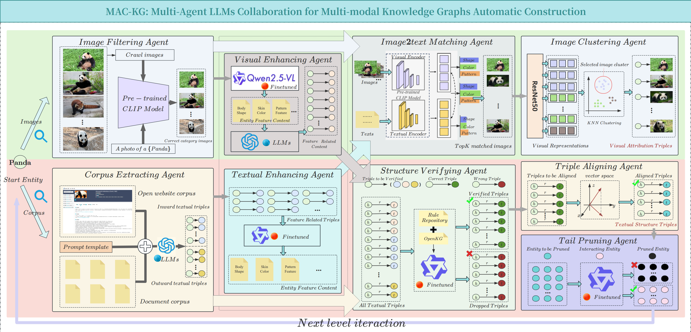
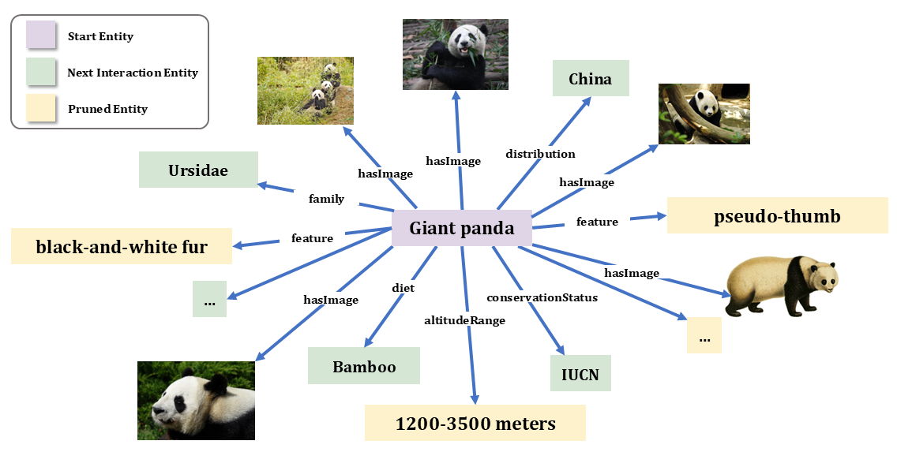

# MAC-KG: Multi-Agent LLMs Collaboration for Multi-modal Knowledge Graph Automatic Construction 🤖 

[](https://opensource.org/licenses/MIT) [](https://www.python.org/downloads/) [](#)

MAC-KG is **the first** framework designed for the automated construction of open-domain multimodal knowledge graphs. It employs a coordinated multi-agent system to iteratively extract and align multimodal entities, enabling the layer-by-layer development of a structured multimodal knowledge graph from scratch. By integrating open-source and fine-tuned large language model (LLM) agents, MAC-KG achieves high-quality multimodal information extraction while ensuring semantic consistency.



> [!NOTE]
> A primitive version of MAC-KG has released, we are still working on updating the pipeline. Feel free to provide suggestions.

## 🧩 Example Multi-modal Knowledge Graph


## 🌟 Highlights

- **Multi-Agent Collaboration**: Nine specialized agents working in synergy to enable end-to-end multi-modal knowledge graph construction.
- **From Scratch Construction**: Fully automatic pipeline starting without prior structured knowledge or manual annotations.
- **Multi-Modal Integration**: Joint extraction, mutual enhancement, and alignment of entities and relations across textual and visual modalities.
- **Domain-Specific Adaptation**: Tailored to vertical domains for high-quality, fine-grained knowledge representation.

## 🎯 Core Agents

### 1. Corpus Extracting Agent
- Input: Textual corpora $C$ from web pages and authoritative documents which are related to the start entity $e_{start}$
- Function: Combined with the prompt template $\mathcal{Template}$, the large language model is used to extract triples from the corpus
- Output: Textual triples $T_{cea}$, which are divided into visual-related triples $T_{v-r}$ and other triples

### 2. Image Filtering Agent
- Input: Images $I$ scraped from the web and authoritative documents which are related to the start entity $e_{start}$
- Function: Using CLIP to filter out low-quality images and retain high-quality images that are relevant to the start entity
- Output: High-quality images $I_{ifa}$

### 3. Textual Enhancing Agent
- Input: Visual-related triples $T_{v-r}$ extracted by the Corpus Extracting Agent
- Function: Use fine-tuned LLMs (Qwen2.5-7B, 14B are used here) to convert visual related triplets into textual information (Graph-to-text)
- Output: Textual information $Text_{tea}$ related to the visual feature of the start entity $e_{start}$ related to images

### 4. Visual Enhancing Agent
- Input: High-quality images $I_{ifa}$ filtered by the Image Filtering Agent
- Sub-function: Use fine-tuned large language-vision model (Qwen2.5-VL are used here) to convert images into textual information $Text_{vea}$ (Image-to-text)
- Sub-function: Use LLMs (GPT-4) to extract visual-related triples from the textual information $Text_{vea}$ generated by the previous high-quality images $I_{ifa}$
- Output: visual-related triples $T_{vea}$ related to images

### 5. Structural Verifying Agent
- Input: Textual triples $T_{cea}$ and images generated visual-related triples $T_{vea}$
- Function: Using fine-tuned LLMs to verify and correct the textual triples $T_{cea}$ and images generated visual-related triples $T_{vea}$ to ensure the correctness and conflict-free of the extracted triples
- Output: Verified and corrected textual triples $T_{sva}$

### 6. Triple Aligning Agent
- Input: Verified and corrected textual triples $T_{sva}$
- Function: The head and tail nodes and relationships of triples $T_{sva}$ are projected into a unified vector space to achieve triple alignment and disambiguation.
- Output: Aligned triples $T_{taa}$ and tail entities $E_{taa}$

### 7. Tail Pruning Agent
- Input: Tail entities $E_{taa}$
- Function: Use the fine-tuned LLM to prune the tail entities $E_{taa}$ to determine the entities $E_{tpa}$ that can enter the next round of iteration.
- Output: Pruned tail entities $E_{tpa}$

### 8. Image2text Matching Agent
- Input: High-quality images $I_{ifa}$ and textual information $Text_{tea}$ generated by the Textual Enhancing Agent
- Function: Use CLIP to match the text information $Text_{tea}$ with the high-quality image $I_{ifa}$ and filter out the top-K images $I_{itm}$ from the matching scores from high to low
- Output: Top-K images $I_{itm}$

### 9. Image Clustering Agent
- Input: Top-K images $I_{itm}$
- Function: Use K-means to cluster the top-K images $I_{itm}$ into M clusters and select the image closest to the cluster center as the representative image of the cluster
- Output: M representative images $I_{ica}$ and the final visual triples $T_{ica}$

## 🚀 Quick Start

To quickly get started with MAC-KG, please read the following tips carefully 
#### 1. The fine-tuned models:
- The fine-tuned models used in MAC-KG are not publicly available due to licensing restrictions. However, you can replace them with other open-source models or use the original versions of the models. 
- The graph-based fine-tuning dataset used in this article has been open-sourced on [https://huggingface.co/Quxiaolong2024](https://huggingface.co/Quxiaolong2024).
- We have published our desensitized multi-card fine-tuning source code in the folder `finetuned_related`. (There are sections for LoRA fine-tuning and full fine-tuning)

#### 2. The initial textual corpus and images:
- The initial textual corpus and images related to the start entity can be obtained by web scraping or using APIs from search engines like Google or Bing. You can also use authoritative documents such as Wikipedia articles or academic papers.
- In our release code, we provide a simple web scraping script $ContentCrawler$ to help you get started. You can find it in the `SelfUtils` folder.
- We encourage users to implement more file parsing scripts to enrich the initial input, such as PDF parsing scripts.

#### 3. CLIP and Sentence-Transformers:
- We use CLIP to filter low-quality images and match text with images. You can choose different versions of CLIP models based on your requirements. In our experiments, we used `openai/clip-vit-base-patch32`.
- We use Sentence-Transformers to project entities and relations into a unified vector space for alignment and disambiguation. You can choose different versions of Sentence-Transformers models based on your requirements. In our experiments, we used `all-MiniLM-L6-v2`.
- You can change the CLIP and Sentence-Transformers models in the `main.py` file.
- Please download the models to `models` folder before running the code to avoid download errors during execution.

#### 4. Easy-to-start:
- In the `main.py` file, after configuring all the agent interfaces, just run:


```bash
python main.py \
--start_entity pandas \
--textual_base ./textual_base \
--visual_base ./visual_base \
--hop 3 \
--max_neighbors 8 \
--store_dir ./output
```

## 📊 Output Format

MAK-KG generates multi-modal knowledge triples with files as follows:

- entity2id.jsonl
```json
{"name": "pandas", "id": 0}
{"name": "bear species", "id": 1}
{"name": "China", "id": 2}
```
- relation2id.jsonl
```json
{"name": "is a type of", "id": 0}
{"name": "endemic to", "id": 1}
{"name": "characterised by", "id": 2}
```
- textual_triples2id.jsonl
```json
{"head": 0, "relation": 0, "tail": 1, "type": 0}
{"head": 0, "relation": 1, "tail": 2, "type": 0}
{"head": 0, "relation": 2, "tail": 3, "type": 0}
```
- visual_triples2id.jsonl
```json
{"head": 0, "relation": -1, "tail": "image1.png", "type": 1}
{"head": 1, "relation": -1, "tail": "image2.png", "type": 1}
```
> [!NOTE]
> In the relation encoding, -1 indicates the ‘hasImage’ relation; in the type encoding, 0 indicates textual modality and 1 indicates visual modality.

## 🛠️ Technical Requirements

- Python 3.9+
- Dependencies: Please see the `requirements.txt` file for a complete list of dependencies.

## 📄 License

This project is licensed under the MIT License - see the [LICENSE](LICENSE) file for details.

## 📬 Contact

For questions and feedback:
- Open an issue
- Email: quxiaolong@bjfu.edu.cn

## 🔖 Cite Information

```bash
@article{qu2025mackg,
  title={MAC-KG: Multi-Agent LLMs Collaboration for Multi-modal Knowledge Graph Automatic Construction},
  author={Qu, Xiaolong},
  journal={arXiv preprint arXiv: ToBeUploaded},
  year={2025}
}
```

## 🙏 Acknowledgments

- All LLMs we ues in our experiments
- All contributors and users
- Ms. Wei Jiachun from Mianyang, Sichuan
- In particular, special thanks to [KARMA](https://arxiv.org/abs/2502.06472) for inspiring the author's ideas.

## 🤝 Contributing

Thanks in advance! We welcome contributions!